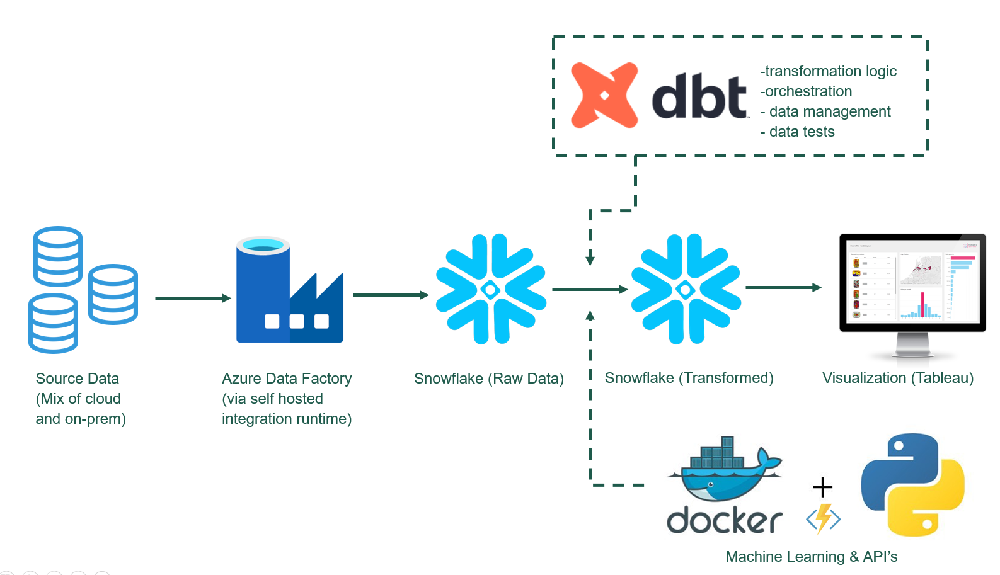

Organizations are moving data workloads to the cloud, in part because of the enormous demand for compute by larger machine learning models, - and even larger data sets. 
For us, it was the sum of both minor (and some critical) issues with our legacy data platform, that prompted us to finally make the move and migrate everything to our new cloud data platform. 

Some of the issues we encountered with our old platform were:

*	Lack of governance and a robust ops framework
*	Little or no automation in deployments (this is huge)
*	Few tests
*	Lots of debugging and countless Data Science hours spent on operating SQL servers and essentially doing DBA work
*	It was difficult to deploy APIs and expose endpoints
*	No real short-term solution to scale compute 
*	Users were frustrated with timeliness and quality of data 
*	Too many servers, operating them all was a pain 

While these issues were piling up, business users were frustrated with data quality and timeliness of data. Data Scientists and engineers were frustrated with operating and developing on the platform itself. Deploying code was a huge mess with little automation and testing. Something had to be done.

### How we did it

Our overall data strategi in the organization was - from the beginning - centered around three key focal points, aimed at scaling the data capabilities of the organization:

*	Data literacy in the organization
*	People & skills in the Data & Analytics team
*	Compute (building an architecture that reliably supports heavy ML & AI workloads)

The data maturity of the organization was the first place we started. We held workshops, internal learning sessions, and matured the understanding of data lifecycle, use cases, and data governance. Preparing for the future, it is important that data is not only a competence within the data team, but also top of mind across all major functions of our organization. 

Simultaneously, we brought on new people for the Data & Analytics team, effectively doubling the size of team in a year. The areas where we scaled up, particularly, were in the fields of Data Engineering & Data Science.

The next challange was scaling compute. Essentialy building a new platform that suited our needs and could support heavy AI workloads.

### The promise (and fear) of the cloud for data science teams
The cloud promises infinite compute and scalable infrastructure on-demand. This is highly attractive to someone stuck with an on-premises data platform, where (for some) the experience is the opposite. It is not all roses though; the cloud can be quite a costly acquaintance.

I’d argue that – especially for smaller data science teams – the cloud makes perfect sense. We’ve seen our costs decrease 50 % after completing our migration to our cloud data platform. A cost-centric mindset is super important and actively thinking about spend, - and designing a cost-effective architecture from the get-go, is the key to how we’ve been able to keep costs down. 

Beware of cost benchmarks and rosy sales pitches. Early in our adoption phase, I was shown a graph, illustrating how some vendors were 3-4 times more expensive than others per hour of unit of compute. However, to make an adequate calculation of how this will impact a final budget for running a particular workload, you need to consider billing structure compared to expected workload and runtime. As a small data science team in a small-ish company, it simply did not make sense subscribing to a platform that uses per-hour billing and will charge you a full hour for compute workloads that run for 30 minutes. 

#### What we also wanted from our platform, besides keeping costs down:

*	Code first (IAC where possible)
*	Full Automation (tests, deployments, scheduling, everything)
*	Scalability of compute
*	Ease of use (for both data scientists and key stakeholders in the organization)
*	Operations, GDPR, security, compliance
*	Serverless

We finally settled for an Azure-hosted Snowflake instance as the core of our data architecture. Snowflake had a billing structure that aligned perfectly with our needs for running multiple smaller workloads during the day (Snowflake is billed per second). It was cheap, effective, and reliable. It is a PaaS offering, so it does not require a DBA to operate. Perfect for our needs at the time.

The image above is a crude simplification of our current data stack in 2023, but it shows how the various pieces are connected in our architecture. Snowflake & dbt handles all major data wrangling and transformation tasks, while Python + AKS handles all ML and AI workloads.  

Our platform and architecture, for the past 2 years, has supported +25 ML models in production, +100 dashboards (with ~150 users), countless data workloads and reverse ETL flows. All while a team of 8 data scientists/engineers/analysts, are actively collaborating on development of new data products.

We are now able to ship machine learning and data products in a couple of weeks. Down from months. 

Our platform spend is down 50 %.

### How we got there
Once we’d settled on an architecture we really believed in, it was time to make the final migration. We divided the migration process in a few key steps:

*	Spin up core elements of the platform (build the integrations)
*	Migrate raw sources (stage with ADF and dump in blob/snowflake)
*	Rewrite transformations in dbt
*	Deploy ML models on AKS
*	Point dashboards to new sources
*	Have all the above in fully automated CI/CD pipelines. Write tests

While this – on paper – looks like a completely doable list of chores, the reality is that this migration was not smooth sailing. There was be downtime. We missed critical things in our initial planning. 
My advice will be to spend ample time on planning the migration in detail. Consider who does what, when. Make lists. When trouble arises, make new lists, and make new plans. 

In the end, it will all be worth it: By embracing the cloud, we unlocked a heap of benefits that have transformed the way we operate and deliver value to our organization. The advantages of the new cloud data platform are many:

*	Infinite Compute and Scalability: The cloud (and snowflake) offers limitless compute resources, which allow us to handle even larger machine learning models and massive datasets seamlessly. This scalability empowers our data science team to deploy ML models with confidence.
*	Robust Governance and Automation: While migrating our data workloads, we established a robust governance framework and embraced automation, seeking to streamline data operations, and reduce the risk of errors. This has significantly improved our data management practices and enhanced data quality and reliability.
*	Cost Efficiency: Despite our initial and legitimate concerns about cloud costs, we learned to be cost-conscious and design a cost-effective architecture. Through careful planning and optimization, we saw a 50% decrease in costs after our migration.
*	Improved User Experience: Timeliness and data quality were constant sources of frustration for our users with the legacy stack. By transitioning to the cloud, we now deliver data more efficiently and in near real-time, meeting our users' expectations and driving better decision-making.

Our experience shows that, especially for smaller data science teams, migrating to a data platform is a feasible, - and that it certainly can be a sensible endeavor from a cost perspective. But - as always. Tread with caution. 
